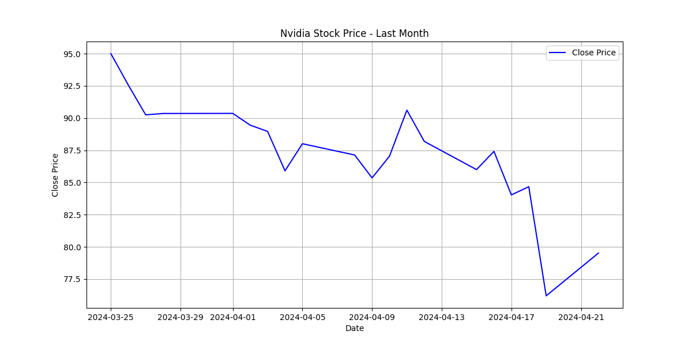

# Nvidia Stock Price Performance: March to April 2024

## Overview

In the past month, Nvidia's stock has experienced significant movements. Here are some key statistics:

- **Opening Price (March 23, 2024):** $93.94
- **Closing Price (April 23, 2024):** $79.52
- **Highest Price:** $96.77
- **Lowest Price:** $75.61
- **Total Trading Volume:** 9,482,145,000 shares

The overall change in Nvidia's stock price over the past month is an impressive -16.30%.

## Detailed Analysis

Throughout the last month, Nvidia's stock price has seen considerable volatility, which is typical for tech stocks. Below is a detailed plot of the stock's closing prices over this period:

From the plot, it can be observed that Nvidia's stock price reached its highest point at $96.77 and its lowest point at $75.61. The variability in daily percentage changes underscores the stock's volatility. 

The substantial decrease of 16.30% in Nvidia’s stock price over the past month may stem from various factors, including market conditions, industry trends, or specific company news. Investors are advised to consider these factors and perform due diligence before making trading decisions.
